

🛍️ Mall Customer Segmentation

Unsupervised Learning Project — Customer Segmentation with K-Means, Hierarchical Clustering & DBSCAN

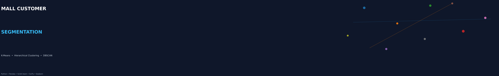

  
  
  
  
  

📌 Project Overview

This project applies unsupervised machine learning to segment mall customers using demographic and spending information.

The analysis focuses on Annual Income and Spending Score and compares three clustering approaches:

K-Means Clustering

Agglomerative Hierarchical Clustering

DBSCAN

The notebook follows a complete workflow from data loading → EDA → scaling → clustering → evaluation → business insights.

🎯 Objectives

Explore the Mall Customers dataset.

Clean and prepare the data for clustering.

Standardize numerical features.

Select Annual_Income and Spending_Score for customer segmentation.

Determine a suitable number of K-Means clusters using the Elbow Method and Silhouette Score.

Perform Agglomerative Hierarchical Clustering using Ward linkage.

Tune and apply DBSCAN using eps and min_samples.

Compare clustering algorithms using silhouette score and noise points.

Translate customer segments into practical marketing actions.

📊 Dataset & Features

The notebook loads:

Mall_Customers.csv

Original columns include:

Feature

Description

CustomerID

Customer identifier

Gender

Customer gender

Age

Customer age

Annual Income (k$)

Annual income

Spending Score (1-100)

Spending score

The notebook renames:

Annual Income (k$)       → Annual_Income
Spending Score (1-100)  → Spending_Score

CustomerID is removed and Gender is label encoded.

🔎 Exploratory Data Analysis

Age, Income & Spending Distributions

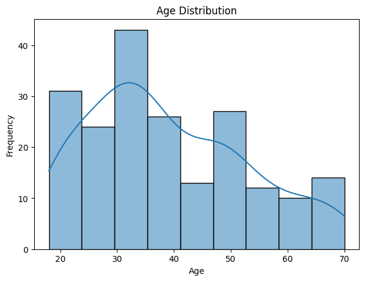
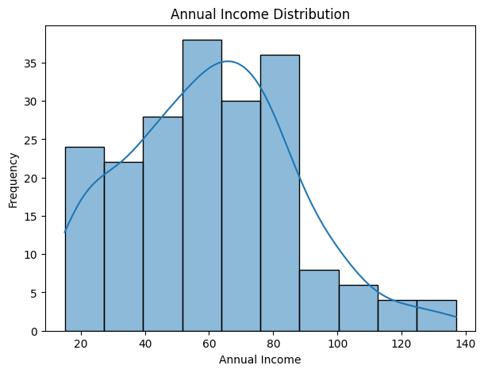
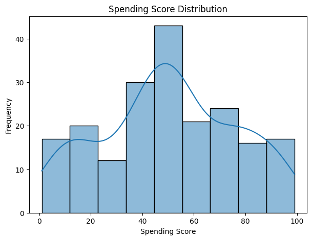

Pairwise Relationships

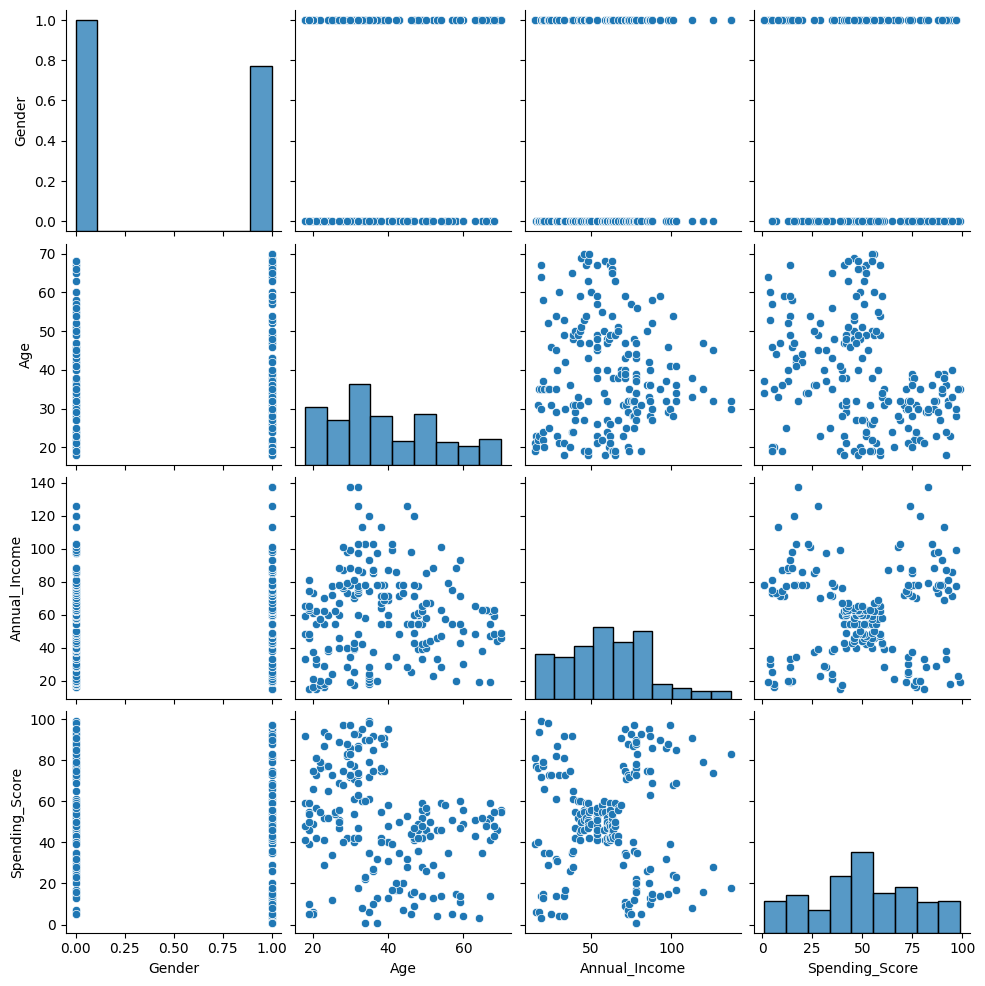

Correlation Heatmap

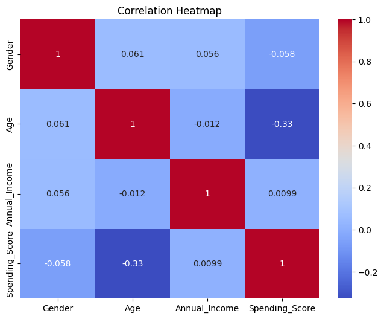

⚙️ Preprocessing

StandardScaler is used on:

Age
Annual_Income
Spending_Score

For clustering, the notebook uses the two-feature dataset:

Annual_Income
Spending_Score

Scaling makes the features comparable so that a larger numerical range does not dominate the clustering process.

🤖 Clustering Analysis

1️⃣ K-Means Clustering

Elbow Method

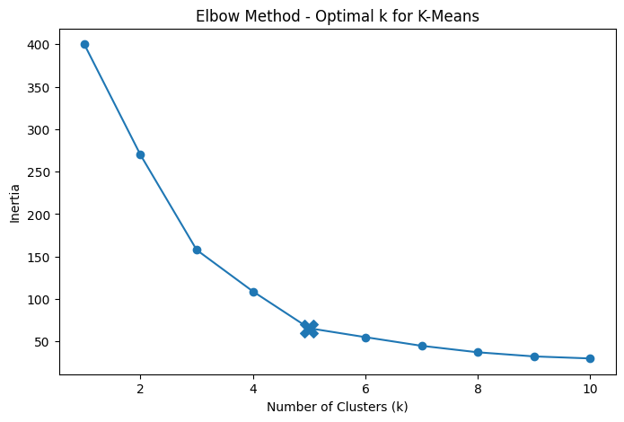

The notebook marks k = 5 for the final K-Means model.

Silhouette Analysis

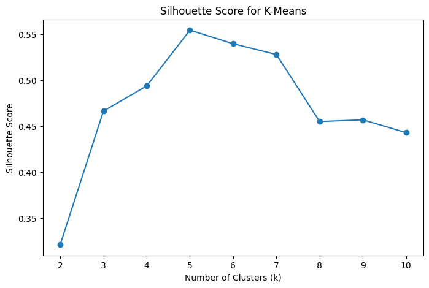

The notebook records the following silhouette scores:

k

Silhouette Score

2

0.321

3

0.467

4

0.494

5

0.555

6

0.540

7

0.528

8

0.455

9

0.457

10

0.443

K-Means Customer Segments

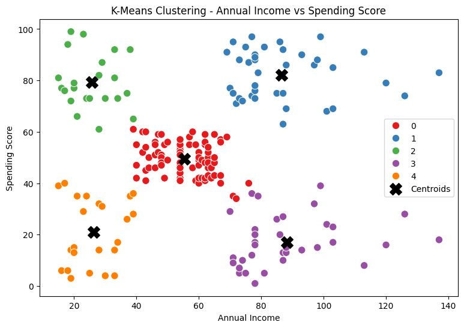

The final K-Means model creates 5 clusters.

Cluster

Avg. Age

Avg. Income

Avg. Spending

0

42.72

55.30

49.52

1

32.69

86.54

82.13

2

25.27

25.73

79.36

3

41.11

88.20

17.11

4

45.22

26.30

20.91

📌 Segment Interpretation

Cluster 1: High income + high spending → premium/loyalty campaigns.

Cluster 2: Low income + high spending → budget-friendly promotions.

Cluster 3: High income + low spending → personalized offers.

Cluster 4: Low income + low spending → value deals and targeted discounts.

Cluster 0: Middle-income / medium-spending customers → general engagement campaigns.

🌳 2️⃣ Agglomerative Hierarchical Clustering

Dendrogram

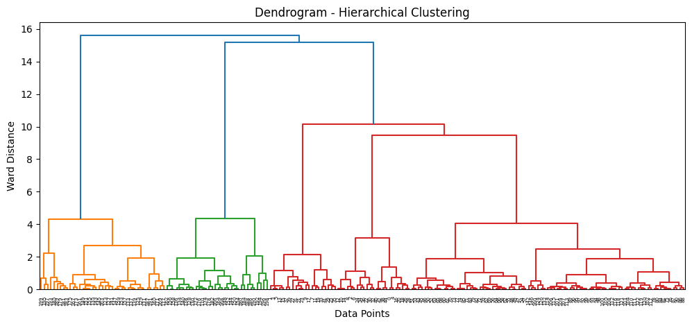

The notebook uses:

AgglomerativeClustering(
    n_clusters=5,
    linkage="ward"
)

Hierarchical Clusters

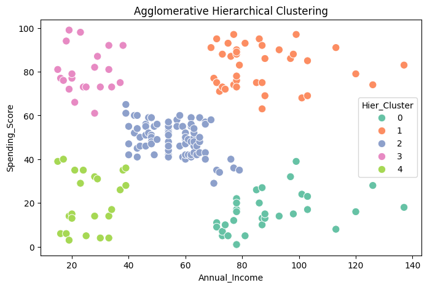

K-Means vs Hierarchical

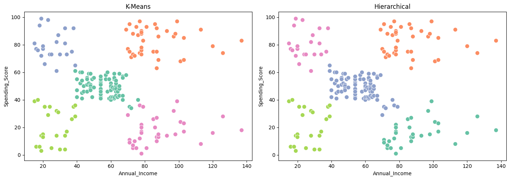

The two approaches produce broadly similar customer groupings, while some boundary customers can be assigned differently because K-Means is centroid-based and hierarchical clustering is based on cluster connectivity/merging.

🧩 3️⃣ DBSCAN Clustering

4-NN Distance Plot

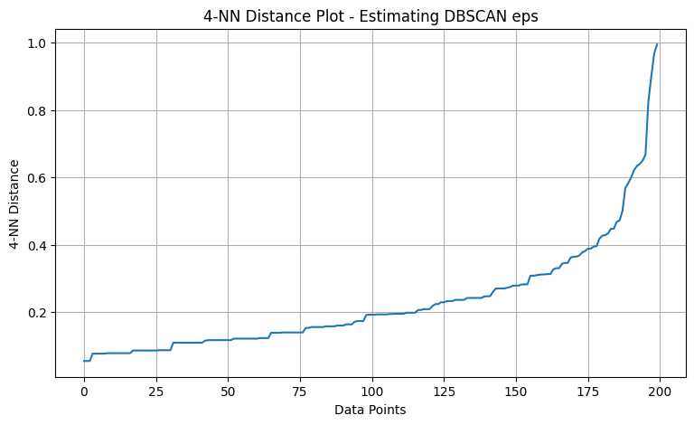

The notebook tests:

eps = 0.2, 0.3, 0.4, 0.5, 0.6
min_samples = 3, 4, 5, 6

The final notebook configuration is:

eps = 0.4
min_samples = 5

DBSCAN Clusters

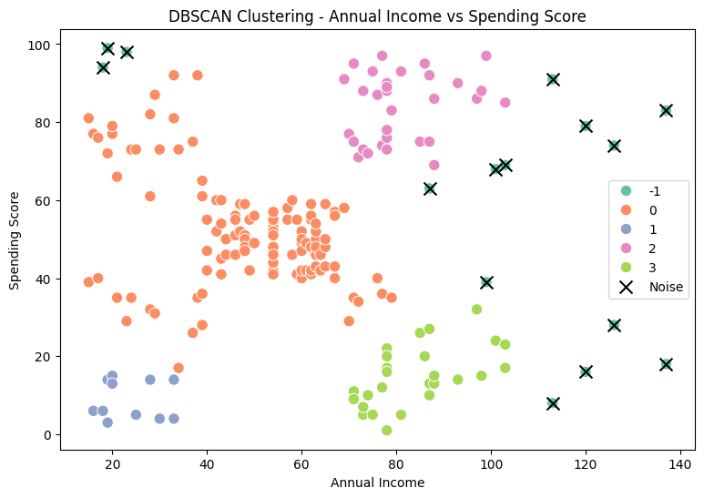

DBSCAN labels low-density observations as noise (-1).

📈 Algorithm Comparison

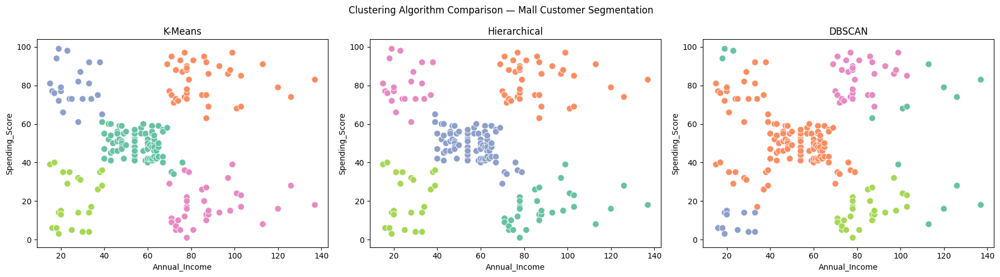

The notebook reports:

Algorithm

Clusters

Silhouette Score

Noise Points

K-Means

5

0.555

0

Hierarchical

5

0.554

0

DBSCAN

4

0.478

15

What the metrics show

K-Means and Hierarchical clustering have very similar silhouette scores in this notebook.

K-Means records a silhouette score of 0.555.

Hierarchical clustering records 0.554.

DBSCAN identifies 15 noise points under the final configuration.

DBSCAN also produces 4 clusters under the final configuration.

💼 Business Insights for Mall Management

The customer segments can be translated into targeted marketing strategies:

Customer Pattern

Suggested Action

💎 High Income + High Spending

Loyalty rewards, premium offers

🛒 Low Income + High Spending

Budget promotions, discounts

🎯 High Income + Low Spending

Personalized recommendations

💰 Low Income + Low Spending

Value deals and targeted discounts

📊 Middle Income + Medium Spending

General engagement campaigns

Management Takeaway

Customer segmentation allows marketing campaigns to move from a one-size-fits-all approach toward targeted customer groups based on income and spending behavior.

🛠️ Tech Stack

Category

Tools

Language

Python

Data Analysis

Pandas, NumPy

Visualization

Matplotlib, Seaborn

Machine Learning

Scikit-learn

Hierarchical Clustering

SciPy

Environment

Jupyter Notebook / VS Code

Documentation

Markdown

📂 Repository Structure

Mall-Customer-Segmentation/
│
├── 📓 MALL CUSTOMER.ipynb
├── 📄 README.md
├── 📄 requirements.txt
│
└── 📁 assets/
    ├── hero.png
    ├── project_metrics.png
    ├── age_distribution.png
    ├── income_distribution.png
    ├── spending_distribution.png
    ├── pairplot.png
    ├── correlation_heatmap.png
    ├── elbow_method.png
    ├── silhouette_scores.png
    ├── kmeans_clusters.png
    ├── hierarchical_dendrogram.png
    ├── hierarchical_clusters.png
    ├── kmeans_vs_hierarchical.png
    ├── dbscan_k_distance.png
    ├── dbscan_clusters.png
    └── algorithm_comparison.png

▶️ How to Run

1. Clone the repository

git clone <your-repository-link>
cd Mall-Customer-Segmentation

2. Install dependencies

pip install -r requirements.txt

3. Add the dataset

Place:

Mall_Customers.csv

in the same directory as the notebook.

4. Open the notebook

jupyter notebook "MALL CUSTOMER.ipynb"

Run:

Kernel → Restart & Run All

📌 Project Highlights

✔ Exploratory Data Analysis
✔ Feature Scaling
✔ K-Means Clustering
✔ Elbow Method
✔ Silhouette Analysis
✔ Agglomerative Hierarchical Clustering
✔ Dendrogram
✔ DBSCAN
✔ Parameter Grid Search
✔ Noise Detection
✔ Algorithm Comparison
✔ Business Segmentation Insights

👤 Author

Manan Patel

🔗 GitHub:
https://github.com/pmanan2031-web

⭐ Mall Customer Segmentation

Turning customer data into meaningful segments and actionable marketing insights.

